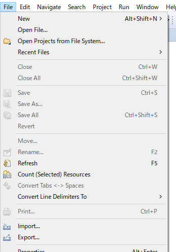
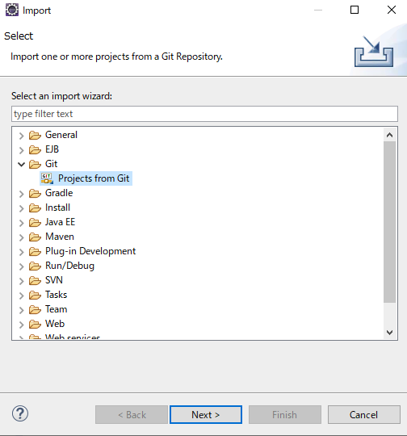
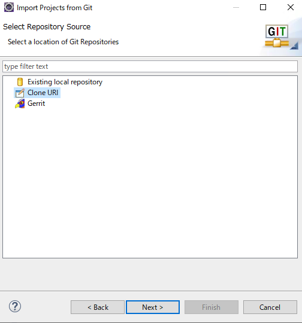
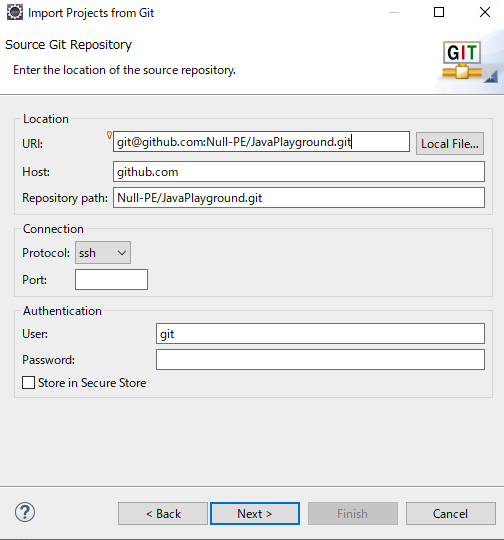
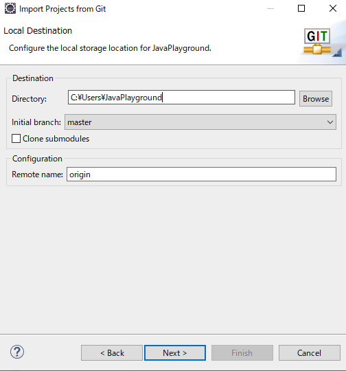

## Java 練習問題

## Setup

1. 利用する予定のEclipse workspaceを用意して、開きます
2. 画面左上のメニューから [File] -> [Import...]  

3. [Git] -> [Project from Git] を選択して、[Next]  

4. [Clone URI] を選択して、[Next]  

5. [URI] に `git@github.com:Null-PE/JavaPlayground.git` を貼り付けて、[Next]   

6. [Directory] にソースコードの置く場所を設定し、[Next] -> [Next] -> [Finish]　  

