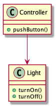
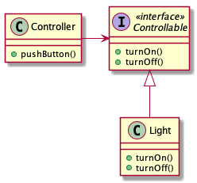
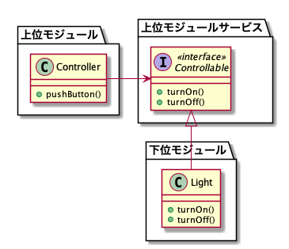

# 依存性逆転の原則

オブジェクト指向プログラミングの分野において、[SOLID](https://ja.wikipedia.org/wiki/SOLID) という設計原則があります：
* 単一責任の原則（Single responsibility principle）
* 開放閉鎖の原則（Open–closed principle）
* リスコフの置換原則（Liskov substitution principle）
* インターフェイス分離の原則（Interface segregation principle）
* 依存性逆転の原則（Dependency inversion principle）

今回はSOLIDのDについて、練習したいと思います。

### 依存性逆転の原則　とは

1. 上位モジュールは下位モジュールに依存してはならない、両方とも「抽象」に依存すべき
2. 「抽象」は「詳細」に依存してはならない、「詳細」が「抽象」に依存すべき

 例えば、以下のクラス関係があります
```java
class Controller{
...
    public void pushButton(Light light){
        if(light is on){
            light.turnOn();
        }else{
            light.turnOff();
        }
    }
...
}


class Light{
    public void turnOn(){
        // turn on 
    }
    public void turnOff(){
        // turn off
    } 
}
```

ここ`Controler`と `Light`は以下の関係となります。



しかし、これで`Controller`は`Light`専用のインステンスしか作れなくなります。なぜなら、`Controller`は`Light`の実装に制限されました。

ならば、テレビのコントローラーを作り時、どうしましょう？

```java
class Television{
    public void turnOn(){
        // turn on 
    }
    public void turnOff(){
        // turn off
    } 
}

...

Controller tvController = new Controller();
Television tv = new Television();
tvController.pushButton(tv); // ダメですね

...
```

> Television実装対応するため、Controllerを変更することは、同時に[開放閉鎖の原則（Open–closed principle）]も違反します

具体的な`Light`に依存することから、抽象的なものに依存することに修正しましょう：

```java
class Controller{
...
    public void pushButton(Controllable target){
        if(......){
            target.turnOn();
        }else{
            target.turnOff();
        }
    }
...
}

interface Controllable{
    void turnOn();
    void turnOff();
}

class Light implements Controllable{
    @Override
    public void turnOn(){
        // turn on 
    }
    @Override
    public void turnOff(){
        // turn off
    } 
}
```

変更後のクラス関係は以下となります：



上位モジュールが下位モジューリに依存する関係性から、両方とも上位モジュールの処理から抽出した抽象対象に依存する関係になります。これは依存性逆転です。



> Adapter Patternと似たような感じがしませんか？ Right! Adapter PatternはDIPを守ためよく使う方法の一つです。

実際の開発でできること：
1. 下位モジュールはできれば、抽象なものを継承・実現する
2. 変数を親抽象クラスやインタフェースで声明する


