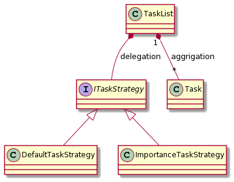

# Strategy パターン
**「ロジックをごっそり切り替える」**

## タイムスケジュール
- 10:30 - 10:33 本日の進め方
- 10:33 - 10:40 解説(例題を見ながらStrategyパターンを解説)
- 10:40 - 10:55 課題
- 10:55 - 11:00 補足。質疑応答

## Strategy パターンの概要
Strategyとは「戦略」のことです。  
あることを実現するために複数の実装方針(戦略)がありえるとします。  
Strategyパターンは、利用シーンによって実装方針(戦略)を切り替えられるようにするパターンです。

## 例題
あなたはタスク管理アプリの以下の機能を実装しています。  
- とりあえずタスクを積んでおき、画面上には今取り組むべきタスクを表示する
- 次にどのタスクを取ってくるのかは設定で決めることができる
- 取り組むべきタスク一覧を表示する機能があり、取り組むべき順序で表示する

以下の実装をStrategyパターンを使って利用シーンに合わせてタスクを表示させられるようにします。(※ `designpattern.strategy.task` パッケージ参照)
- `TaskList.nextTask()` : 次に取り組むべきタスクを取得するメソッド
- `TaskList.getSortedTask`：タスクを取り組むべき順でソートした結果を取得するメソッド

### クラス図

## 課題
### 課題1
タスク管理アプリと同じような動作をするtodo管理アプリを作ってください。  
課題は`designpattern.strategy.todo` パッケージにあります。  

`TodoList` の `nextTodo` と `getSortedTodo` で重要度順に処理を行えるようにしてください。

ヒント:以下の順で実装すると実装しやすいです。
- Todoに重要度をもたせてください
- Todoに重要度順に処理をする`TodoImportanceStrategy`を実装してください。
- 外部から Strategy を渡してTodoListの動きを切り替えられるようにしてください。

### 課題2
オリジナルの処理方法を考えてStrategyを追加してください。  

## 研究課題
課題作成者は今回の課題を作るときにテスト駆動開発で実装しました。  
例題と同じような機能を持つ賞金首を管理するアプリをwantedパッケージ以下にテスト駆動開発で実装してみてください。

参考までに例題を実装したときのTodoリストを記載しました。  
なお、はじめからこの形だったわけではなく、実装しながらTodoリストが増えています。

### (参考)TODOリスト
- [x] タスクを渡すとリストにタスクを追加する
- [x] タスクを終えたらそのタスクをリストから削除する
- [x] タスクのequalsメソッドの実装
- [x] 次のタスクを持ってくる(一番最後に入れたやつを持ってくる)
- [x] タスクを持ってくる戦略を与えたら、その戦略に従って次のタスクを持ってくる
  - [x] デフォルトはFIFO
  - [x] LIFO
  - [x] 重要度の高い順で出力する
- [x] ソートされたタスク一覧を持ってくる
  - [x] デフォルトはFIFO
  - [x] LIFO
  - [x] 重要度の高い順で出力する
- [x] タスクに重要度を保持する
- [x] タスクにはタスクの内容を持てる

## (おまけ)Adopter パターンの応用問題から見る Strategy パターン
`designpattern.facade.answer.FileEditService.upload` を見てください。  
`StorageType` を`FileEditService.upload`に渡すことで、ストレージに合わせた処理を呼び出してUploadしています。  

このようにアルゴリズムの実装を完全に他のクラスに追い出して、
インターフェースを介して利用することで、今度は他のストレージタイプであっても(S3を利用したファイル管理システムとか)、
他のロジックを気にすることなく実装ができるようになります。
